<div align="center">

# 🏛️ CathayOCR

**多引擎 GPU 加速 PDF 批量 OCR 工具**

*开箱即用 · 双击即开 · 专为古籍数字化设计*

[](LICENSE)
[]()
[]()
[]()

---

**打开安装包 → 双击启动 → 拖入 PDF → 开始处理，几分钟后拿到整洁的双层 PDF 和纯文本文件。**

你不需要安装 Python、CUDA 或任何开发环境。甚至不需要知道什么是 OCR。

</div>

---

## 📖 目录

- [这个仓库是什么？](#-这个仓库是什么)
- [你需要下载哪个？](#-你需要下载哪个)
- [为什么需要这个工具](#-为什么需要这个工具)
- [一分钟快速上手](#-一分钟快速上手)
- [版本详解](#-版本详解)
- [核心特性](#-核心特性)
- [引擎架构](#-引擎架构)
- [性能基准](#-性能基准)
- [系统要求](#-系统要求)
- [安装包下载](#-安装包下载)
- [从源码构建 / 修改](#-从源码构建--修改)
- [常见问题](#-常见问题)
- [技术栈与上游项目](#-技术栈与上游项目)
- [许可证](#-许可证)

---

## ❗ 这个仓库是什么？

> **⚠️ 重要提示：GitHub 上的这个仓库只包含 Python 源码（.py）和 C++ 引擎源码（.cpp/.h）。**
>
> **OCR 模型、CUDA 库、便携 Python 等二进制文件因体积过大（单文件最大 637 MB）且超过 GitHub 单个文件 100 MB 的限制，不包含在此仓库中。**
>
> ⬇️ **要直接使用 CathayOCR，请到下方的 [安装包下载](#-安装包下载) 区域下载完整的 Lite / Pro / Dev 安装包。** 那些安装包才是"解压即用"的——它们包含了所有依赖、模型和运行环境。

---

## 🎯 你需要下载哪个？

| 你的身份 | 下载这个 | 理由 |
|:--------|:--------|:------|
| 🟢 **普通用户 / 学者**——识别中文等常见语言 | **Lite 轻量版** | 630 MB，解压即用，多数语言的精度为最高 |
| 🔵 **重度用户**——需阿拉伯文 / 天城文 / 多引擎对比 | **Pro 专业版** | 6 引擎全量 + CUDA GPU 加速 |
| 🟣 **开发者**——想研究 / 修改代码 | **DEV 开发版** | 完整 Python + C++ 源码，全套开发环境 |
| 🟡 **只想改改代码不想装环境** | 任何一个安装包 | .py 文件用记事本就能直接改，改完双击运行 |

> 每个安装包本质上就是一个**完整的项目文件夹**——里面的 Python 脚本、C++ 可执行文件、配置文件都可以直接修改。修改完后重新运行 `启动.bat` 即可看到效果。

---

## 🎯 为什么需要这个工具

你有一批古籍 / 文献的 **PDF 扫描件**，想把里面的文字提取出来变成可搜索、可复制、可编辑的文件？

传统的做法是：打开 PDF → 截图 → 一张张手动打字…… **太累了。**

CathayOCR 帮你全自动做完。你只需要告诉它哪几个 PDF 文件要处理，剩下的事它自己干。

```
157 页古籍校勘记 PDF
├─ 人工手打：4~6 小时
└─ CathayOCR：约 70 秒 ✅  （速度 ×200+）
```

### 谁在用？

| 角色 | 场景 |
|:-----|:-----|
| 📜 **古籍研究者** | 校勘记、地方志、家谱、碑帖整理 |
| 🏛️ **图书馆 / 档案馆** | 批量扫描件数字化 |
| 👩‍🏫 **文史师生** | 文献研究，需要可检索的文本版本 |
| 📖 **文史爱好者** | 整理家谱、旧书、手稿 |
| 🌍 **多语言工作者** | 法文、德文、日文、俄文、韩文、阿拉伯文等多语种 PDF |

---

## 🚀 一分钟快速上手

```bash
1. 下载 Lite 或 Pro 安装包 → 解压到任意文件夹（建议 SSD）
2. 双击文件夹里的「启动.bat」
3. 等 10~30 秒，主界面弹出
4. 拖入 PDF 文件 → 点击「开始处理」
```

> 💡 **首次使用建议**：界面左上角「🎯 简单模式」默认勾选，依次回答文档类型、精度速度、显卡、语言这四个问题，系统自动配好一切参数。10 秒完成设置。

---

## 📦 版本详解

### Lite 轻量版（~630 MB .zip | 解压 ~2 GB）

一个引擎，极致精简。**适合所有用户——尤其是中文古籍和大多数学者。**

| 项目 | 说明 |
|:----|:------|
| **引擎** | ⭐ **ncnn Vulkan**（跨品牌 GPU 加速，无 GPU 自动回退 CPU） |
| **模型** | PP-OCR v5/v6 轻量模型 + v5 Server 模型 |
| **GPU 支持** | NVIDIA / AMD / Intel 任意品牌独立显卡 |
| **CPU 支持** | ✅ 无独显也能跑 |
| **语言** | **~65 种**（V6 字典：CJK、拉丁、西里尔、希腊等） |
| **识别精度** | **多数语言为最高**（ncnn Vulkan 同模型下字符检出率略高于 ONNX CUDA） |
| **依赖** | 便携 Python + 基础依赖库 |
| **适合** | **所有用户，尤其中文学者。对大多数语言来说精度和速度都是最优选择** |

> 💡 **对大多数学者来说 Lite 版就够了**——尤其是中文古籍和大多数欧洲语言。Lite 版使用 V6 字典覆盖约 **65 种语言**（含 CJK、拉丁语系、西里尔文、希腊文），ncnn Vulkan 引擎的精度和速度都是最优的。
>
> ⚠️ Lite **不包含**阿拉伯文、天城文（印地/梵文）、泰文等 V5 语系识别。如有这些需求请使用 Pro 版。

### Pro 专业版（~5.7 GB .zip | 解压 ~9 GB）

六引擎全量。适合需要多语种（阿拉伯文、天城文等）或多引擎对比的用户。

| 项目 | 说明 |
|:----|:------|
| **引擎** | ncnn Vulkan + PP-OCRv6 ONNX CUDA + EasyOCR + ncnn CPU + PP-OCRv5 + PP-OCRv3 |
| **模型** | v3~v6 全套模型 + EasyOCR 多语种模型 + V5 分语系 ONNX 模型（阿拉伯、天城文等） |
| **CUDA 支持** | ✅ 便携版自带 CUDA/cuBLAS/cuDNN DLL（~2.4 GB），即插即用，无需安装 NVIDIA CUDA 工具包 |
| **语言** | **75 种**（含阿拉伯文、天城文、东南亚文字等） |
| **适合** | 需要阿拉伯文、天城文识别，或想在不同引擎间对比效果的用户 |

> 💡 **家用电脑一般不存在此类问题。** 如果遇到 CPU 架构极其古老的云服务器（没有 Vulkan 驱动、没有 CUDA 支持、CPU 型号老旧），Pro 版还有 PP-OCRv5 引擎可用。只需在界面中选「PP-OCRv5 Paddle CPU」即可跑起来，速度虽慢但至少能用。不想要的引擎文件夹也可以直接删除，完全不影响使用。

### DEV 开发版（~7.5 GB .7z | 解压 ~15 GB）

> **这是给开发者准备的版本。** 它包含了 Lite 和 Pro 的所有内容，外加：

| 项目 | 说明 |
|:----|:------|
| **C++ OCR 引擎完整源码** | ncnn 引擎全部 C++ 源码（10 个文件），可使用 Visual Studio 2022 编译 |
| **CMake 构建系统** | 支持 CPU / Vulkan 两种编译配置 |
| **VS2022 工程文件** | 解压后可直接在 Visual Studio 中打开编译 |
| **Vulkan SDK 安装包** | 编译 Vulkan 版本所需（亦可自行下载新版） |
| **ncnn 完整源码** | ncnn 框架源码（含 git 历史），方便修改底层推理引擎 |
| **多套 Python 虚拟环境** | EasyOCR 环境、Surya OCR 实验环境等，方便开发测试 |
| **多语种测试 PDF** | 8 种语言的测试用 PDF 样本 |
| **开发工具脚本** | 模型下载脚本、引擎注册脚本、性能测试脚本等 |

> 💡 **DEV 版本身也是一个完整可用的 OCR 工具**——它和 Pro 版一样包含全部引擎和依赖，解压后双击 `启动.bat` 也能直接使用。

---

## ✨ 核心特性

### 🎯 双模式界面

| 🎯 简单模式 | 🔧 专业模式 |
|:-----------:|:----------:|
| 回答 4 个问题即可开跑 | 全部参数自由调节 |
| 文档类型 → 精度速度 → 显卡 → 语言 | 引擎、模型、批处理、双实例、GPU 设备… |
| 10 秒完成配置 | 适合有经验的高级用户 |

### 🌐 多语言支持

> **Lite 版**覆盖 **~65 种语言**（V6 字典：CJK、拉丁语系、西里尔文、希腊文等）。
> **Pro 版**额外增加 V5 分语系 ONNX 模型和 EasyOCR，总计 **~75 种**。

**Lite / Pro 均支持（V6 通用字典）：**

| 语系 | 包含语言 |
|:-----|:---------|
| **CJK** | 中文（繁简体自动）、日本語、한국어 |
| **西欧拉丁** | English、Français、Deutsch、Español、Italiano、Português… |
| **北欧 / 东欧** | Dansk、Svenska、Polski、Čeština、Magyar… |
| **西里尔文** | Русский、українська、беларуская、български…（13 种） |
| **希腊 / 土耳其 / 越南** | Ελληνικά、Türkçe、Tiếng Việt… |
|…以及其他拉丁语系语言 |共 **~65 种** |

**仅 Pro 版支持（V5 分语系 ONNX + EasyOCR）：**

| 语系 | 包含语言 | 引擎 |
|:-----|:---------|:----:|
| **阿拉伯文系** | العربية、فارسی、ئۇيغۇرچە、اردو | PP-OCRv6 ONNX CUDA |
| **天城文系** | हिन्दी、नेपाली、संस्कृत | PP-OCRv6 ONNX CUDA |
| **东南亚** | ภาษาไทย、తెలుగు、தமிழ் | PP-OCRv6 ONNX CUDA |
| **韩文 / 俄文（增强）** | EasyOCR 专用模型辅助提升 | EasyOCR |
|…|合计约 **+10 种**|

### ⚡ 高性能流水线

```
┌─ CPU 渲染线程 ─┐     ┌─ OCR 引擎线程 ─┐
│ PyMuPDF 预渲染   │ ──→ │ 6 引擎统一适配    │ ──→  ├─ 原文件名_result.txt
│ 多页并行        │     │ 双实例并发       │       └─ 原文件名_layered.pdf
│ 消除 I/O 瓶颈   │     │ GPU 永不等待     │            （图像+文本双层）
└─────────────────┘     └─────────────────┘
```

**设计理念**：CPU 在后台持续预渲染 PDF 页面并压入队列，OCR 引擎从队列中全速消费。GPU 永不等待，CPU 永不空闲。

**输出文件**：每个 PDF 处理完成后生成两个文件：
- `原文件名_result.txt` — 纯文本识别结果
- `原文件名_layered.pdf` — **图像+文本双层 PDF**，可在其中选中、复制、搜索文字

### 🛡️ 军工级容错

- **超时保护**：单页 OCR 超过 180 秒自动跳过
- **安全定时器**：整体任务无进度超过 300 秒触发紧急停止
- **进程清理三保险**：SIGTERM → `taskkill /f` → `atexit` 兜底
- **快速取消**：直接终止子进程，秒级响应

### 🖥️ GPU 选型建议

| 你的显卡 | 推荐引擎 | 理由 |
|:---------|:--------|:------|
| **NVIDIA 显存 ≥ 8 GB**（如 RTX 3060/4060/5060 及以上） | ONNX CUDA 或 **ncnn Vulkan 双实例** | 显存充裕时 ONNX CUDA 精度优；ncnn Vulkan 双实例速度最快 |
| **NVIDIA 显存 ≤ 8 GB**（如 RTX 3050/4050） | ⭐ **ncnn Vulkan 双实例** | 双实例速度翻倍，不爆显存 |
| **AMD Radeon / Intel Arc 独显** | ⭐ **ncnn Vulkan 双实例** | 唯一 GPU 加速选项，效果很好 |
| **无独显 / 纯核显** | **ncnn CPU** | 兼容稳定 |

> 💡 **还不知道怎么选？** 开「🎯 简单模式」→ 显卡选「我不知道」→ 系统自动检测最优配置。

---

## ⚙️ 引擎架构

CathayOCR 通过 **`ENGINE_REGISTRY`** 统一管理 6 个 OCR 引擎。**所有引擎均输出 TXT + 双层 PDF**：

```mermaid
graph TD
    UI[PyQt5 用户界面] --> SM{模式选择}
    SM -->|🎯 简单模式| Auto[自动参数映射]
    SM -->|🔧 专业模式| Manual[手动参数配置]
    Auto --> Engine[引擎调度器 &#91;ENGINE_REGISTRY&#93;]
    Manual --> Engine

    Engine --> NCNN[⭐ ncnn Vulkan<br/>TCP 持久连接<br/>任意品牌 GPU]
    Engine --> ONNX[PP-OCRv6 ONNX CUDA<br/>管道 JSON 协议<br/>NVIDIA 专属]
    Engine --> EOCR[EasyOCR<br/>管道 JSON 协议<br/>韩文/俄文特化]
    Engine --> CPU[ncnn CPU<br/>子进程单次调用]
    Engine --> V5[PP-OCRv5 Paddle CPU]
    Engine --> V3[PP-OCRv3 Paddle CPU]

    subgraph 输出 [每个引擎均输出]
        Out1[纯文本 .txt]
        Out2[双层 PDF .pdf<br/>图像 + 可选文字层]
    end

    NCNN --> 输出
    ONNX --> 输出
    EOCR --> 输出
    CPU --> 输出
    V5 --> 输出
    V3 --> 输出
```



### 各引擎一句话总结

| 引擎 | 什么时候用 |
|:-----|:-----------|
| ⭐ **ncnn Vulkan** | **默认首选**。速度最快，任意品牌显卡都能加速，没显卡自动切 CPU。**多数语言精度最高** |
| **PP-OCRv6 ONNX CUDA** | 含阿拉伯文、天城文的多语种 PDF。显存 ≥ 8 GB 时推荐。便携版自带 CUDA DLL，即插即用 |
| **EasyOCR** | 韩文 / 俄文专用，识别效果优于 PP-OCR |
| **ncnn CPU / Paddle CPU** | 备胎引擎，其他都用不了时顶上 |

---

## 📊 性能基准

**测试环境**：AMD Ryzen 7 9700X · NVIDIA RTX 5060 8GB · 32GB DDR5 · NVMe SSD · Windows 11 24H2

| 配置 | 页数 | 耗时 | 速度 | GPU 利用率 |
|:----|:----:|:----:|:----:|:----------:|
| ⭐ **ncnn Vulkan 双实例 FP16 v6 Medium** | 157 | **~70 s** | **~2.2 p/s** | ~85% |
| PP-OCRv6 ONNX CUDA 单实例 v6 Medium | 160 | ~145 s | ~1.1 p/s | ~60% |
| ncnn CPU 单实例 FP32 v6 Medium | 100 | ~300 s | ~0.3 p/s | N/A |

> **实测数据**：157 页古籍校勘记 → 约 **70 秒** → 识别出约 **5 万字**。人工手打需要 4~6 小时。
>
> **字符覆盖率**：ncnn Vulkan 比 ONNX CUDA 略高（101.4% vs 100%），属于检测框分割策略差异。CUDA 版对表格和校勘条目（「○」「□」）识别更稳定。

---

## 💻 系统要求

| 项目 | 最低配置 | 推荐配置 |
|:----|:--------|:--------|
| **操作系统** | Windows 10 x64 1809+ | Windows 10/11 x64 |
| **内存** | 8 GB | 16 GB+ |
| **磁盘空间** | 根据版本 2~15 GB | SSD |
| **显卡** | 不需要（CPU 可用） | NVIDIA RTX / AMD RX 5000+ / Intel Arc |
| **运行时** | **无需安装任何东西** | **无需安装任何东西** |

---

## 🔧 安装包下载

> 安装包内含**完整 Python 3.10 解释器 + 全部依赖库 + CUDA DLL + OCR 模型**，真正做到 **解压即用，无需任何安装步骤**。
>
> ⚠️ GitHub 仓库仅包含源码，如需直接使用或修改，请下载以下安装包：

| 版本 | 格式 | 大小 | 包含内容 | 下载 |
|:---:|:----:|:----:|:--------|:----:|
| **Lite 轻量版** | .zip | ~630 MB | ncnn Vulkan 引擎 + 基础模型 + 便携 Python | [GitHub Releases](https://github.com/zzhjim02/CathayOCR/releases/tag/v1.0.0) ⭐ / [百度网盘](https://pan.baidu.com/s/1T1qUGrG6Kq_Td1ASsWBCtw?pwd=2026)（`2026`） |
| **Pro 专业版** | .zip (4 卷) | ~5.7 GB | 6 引擎全量 + CUDA DLL + 全部模型 + 便携 Python | [GitHub Releases](https://github.com/zzhjim02/CathayOCR/releases/tag/v1.0.0-pro) ⭐ / [百度网盘](https://pan.baidu.com/s/14K95tkJOzzopbjuGy0290Q?pwd=2026)（`2026`） |
| **DEV 开发版** | .7z (5 卷) | ~7.5 GB | Pro 全部内容 + C++ 引擎源码 + VS 工程 + ncnn 源码 + 开发工具 | [GitHub Releases](https://github.com/zzhjim02/CathayOCR/releases/tag/v1.0.0-dev) ⭐ / [百度网盘](https://pan.baidu.com/s/1WDZXVVl9zld07fh_JCeVDA?pwd=2026)（`2026`） |

> 💡 **每个安装包都是一个完整的项目文件夹**。里面的 `*.py` 文件用记事本就能直接编辑修改，`ncnn/` 下的 C++ 源码可用 Visual Studio 编译。修改后重新运行 `启动.bat` 即可看到效果。

---

## 🔨 从源码构建 / 修改

### 不想编译，只想改改 Python 代码？

任何一个安装包都包含完整的、可读的 Python 源码。你只需要：

```bash
1. 解压缩安装包
2. 用记事本 / VS Code 打开 CathayOCR-Xxx/umi_ocr_pdf_processor_ui.py
3. 随便改
4. 双击「启动.bat」运行看效果
```

> 就是这么简单。甚至不需要安装 Python——安装包里自带。

### 想编译 C++ OCR 引擎？

下载 **DEV 开发版**，它包含了编译所需的一切：

```bash
# 环境要求
- Visual Studio 2022（含 C++ 桌面开发工作负载）
- CMake 3.20+（DEV 版自带）
- Vulkan SDK 1.4+（DEV 版含安装包）

# 构建 ncnn OCR 引擎
cd CathayOCR-Dev/ncnn

# 构建 CPU 版本
build_cpu.cmd

# 构建 Vulkan 版本（需先安装 Vulkan SDK）
build_vulkan_and_deploy.cmd
```

### 这个仓库里的纯源码怎么用？

GitHub 上的源码**不包含运行环境**，仅适合以下场景：
- **阅读和学习**代码结构
- **提交 Issue 或 PR**
- **对比各版本差异**

**要实际运行或修改，请直接下载安装包。**

---

## ❓ 常见问题

<details>
<summary><b>无显卡服务器报错 SharedMemory read failed？</b></summary>
服务器没有 GPU / Vulkan 驱动时，ncnn Vulkan 子进程反复启动失败导致此报错。

<b>解决方法：</b>打开 <code>ncnn\PPOCR-ncnn-Vulkan\config_safe.json</code>，将 <code>"use_vulkan": true</code> 改为 <code>"use_vulkan": false</code> 即可。改完后完全使用 CPU 运行，不再报错。

> 💡 <b>普通家用电脑不会遇到此问题</b>——集成显卡或独显都自带 Vulkan 驱动，无需任何设置。
</details>

<details>
<summary><b>云服务器 / CPU 架构极老的设备可以用吗？</b></summary>

> 💡 <b>家用电脑一般不存在此类问题。</b>以下内容仅针对配置极其低端的云服务器等特殊环境。

————

<b>第一步：先用 Lite 版试试 V6 CPU 引擎</b>

大部分低配云服务器是可以正常使用 Lite 版内置的 ncnn CPU 引擎（V6）的。如果启动或运行时报错，请依次排查：

① 检查是否安装了必要的 VC++ 运行库；
② 参照本页「无显卡服务器报错」的 FAQ，关闭 Vulkan 模式；
③ 确认上述调整已正确应用。

————

<b>第二步：仍然不行？换 Pro 版的 V5 引擎</b>

如果 V6 CPU 引擎经过排查仍无法使用，可以下载 <b>Pro 专业版</b>，在界面中切换到 <b>PP-OCRv5 Paddle CPU</b> 引擎运行。经测试，部分云服务器的 CPU 架构确实过于古老，无法运行 V6 引擎，而 Pro 版自带的 V5 引擎在这种极低配置下仍可正常工作。

> 💡 <b>不想要的引擎文件可以删除</b>——Pro 版里 ncnn Vulkan、ONNX CUDA、EasyOCR 等引擎文件夹删掉也不影响 V5 引擎使用，可以省下好几 GB 磁盘空间。
</details>

<details>
<summary><b>双击启动.bat 后黑框一闪而过？</b></summary>
解压不完整。确认 <code>portapython\python.exe</code> 文件存在，不要单独移动任何文件夹或修改目录结构。
</details>

<details>
<summary><b>Lite 版和 Pro 版选哪个？</b></summary>
<b>对大多数学者来说 Lite 版就够了。</b>Lite 版使用 ncnn Vulkan 引擎，支持任意品牌 GPU 加速，没显卡也能跑 CPU 模式。**多数语言的识别精度 Lite 版就是最高的**。Pro 版多了 ONNX CUDA、EasyOCR 和 Paddle 备胎引擎，适合需要阿拉伯文 / 天城文识别，或想在不同引擎间对比效果的用户。
</details>

<details>
<summary><b>进度不动了 / 卡住了？</b></summary>
点击「停止」→ 关掉程序 → 重新打开。如果频繁卡住：① 检查任务管理器有无残留 OCR 进程；② 调低批处理数；③ 换 ncnn CPU 引擎。
</details>

<details>
<summary><b>识别结果很多错字？</b></summary>
① 渲染倍率调到 3x；② 图像边长调到 3000；③ 模型选 v6 Server；④ 确认语言选择正确。
</details>

<details>
<summary><b>速度太慢怎么办？</b></summary>
① 确认模式选了"自动"或"GPU 模式"；② 开启「双实例并行」；③ 精度选 FP16；④ 调低渲染倍率到 1x。
</details>

<details>
<summary><b>我想自己改代码，需要什么？</b></summary>
<b>什么都不需要。</b>安装包里的 <code>.py</code> 文件用记事本就能改。改完双击 <code>启动.bat</code> 就能看效果——不需要安装 Python、不需要配置开发环境。如果想编译 C++ 引擎，请下载 DEV 版。
</details>

<details>
<summary><b>和 Umi-OCR 有什么区别？</b></summary>
Umi-OCR 更适合单张图片或少量文字的屏幕识别。CathayOCR 是专为<b>大量 PDF 文件批量处理</b>设计的，多了自动流水线、双实例并行加速、GPU 设备选择、简单模式等功能，批处理效率高得多。
</details>

<details>
<summary><b>安装包里自带的 Python 是什么？可以装包吗？</b></summary>
安装包使用 <code>portapython/</code>（Portable Python 3.10）作为运行环境，它是一个独立的、不干扰系统 Python 的便携发行版。所有依赖已预装好，正常情况下你不需要 pip install 任何东西。如果有特殊需要，可以用 <code>portapython\python.exe -m pip install xxx</code>。
</details>

---

## 🛠️ 技术栈与上游项目

### 直接使用的上游项目

| 项目 | 用途 | 许可 |
|:----|:----|:----:|
| [Umi-OCR](https://github.com/hiroi-sora/Umi-OCR) | OCR 管道架构、通信协议参考 | MIT |
| [PaddleOCR](https://github.com/PaddlePaddle/PaddleOCR) | PP-OCR v3/v5/v6 模型训练框架、字典文件 | Apache 2.0 |
| [Paddle Inference](https://github.com/PaddlePaddle/Paddle) | PP-OCRv3/v5 的 C++ 推理引擎 | Apache 2.0 |
| [ncnn](https://github.com/Tencent/ncnn) | 高性能神经网络推理框架（Vulkan + CPU 跨平台加速） | BSD 3-Clause |
| [ppocr-ncnn-cpp](https://github.com/CrumpetTurtle/ppocr-ncnn-cpp) | ncnn 版 PP-OCR 引擎的 C++ 实现（本项目核心引擎源码二次开发基础） | — |
| [ONNX Runtime](https://github.com/microsoft/onnxruntime) | PP-OCRv6 的 CUDA / TensorRT 加速推理 | MIT |
| [PyMuPDF (fitz)](https://github.com/pymupdf/PyMuPDF) | PDF 渲染引擎 | AGPL |
| [PyQt5](https://riverbankcomputing.com/software/pyqt/) | GUI 框架 | GPL |
| [EasyOCR](https://github.com/JaidedAI/EasyOCR) | 多语言 OCR 引擎（韩文 / 俄文） | Apache 2.0 |

### 本项目引用的 PP-OCR 模型转换版及插件

本项目使用了以下社区转换的 PP-OCR 模型格式及上游 Umi-OCR 插件：

| 模型格式 / 插件 | 来源 | 说明 |
|:----------------|:-----|:-----|
| **ncnn 模型 (.param + .bin)** | 基于 PaddleOCR 官方模型经 ncnn 工具链转换 | 用于 ncnn Vulkan / ncnn CPU 引擎 |
| **ONNX 模型 (.onnx)** | 基于 PaddleOCR 官方模型经 paddle2onnx 转换 | 用于 PP-OCRv6 ONNX CUDA 引擎 |
| **Paddle Inference 模型** | PaddleOCR 官方发布格式 | 用于 PP-OCRv3/v5 引擎 |
| **EasyOCR 模型 (.pth)** | EasyOCR 社区训练模型 | 用于 EasyOCR 引擎 |
| [PaddleOCR-json_PP-OCRv5_umi_plugin](https://github.com/OneDongua/PaddleOCR-json_PP-OCRv5_umi_plugin) | 社区 Umi-OCR 插件 | PP-OCRv5 引擎集成参考 |
| [UmiOCR-AI-OCR-Plugin](https://github.com/EatWorld/UmiOCR-AI-OCR-Plugin) | 社区 Umi-OCR 插件 | AI-OCR 插件集成参考 |
| [UmiOCR-PP-OCRv6-ONNX-Plugin](https://github.com/4965898/UmiOCR-PP-OCRv6-ONNX-Plugin/) | 社区 Umi-OCR 插件（含 Vulkan 实验版） | PP-OCRv6 ONNX CUDA 引擎集成参考，也是本项目 ppocr_v6/ 模块的基础 |

### 本项目 C++ / Python 技术选型

| 组件 | 技术 |
|:----|:----|
| **GUI 框架** | PyQt5 |
| **PDF 渲染** | PyMuPDF (MuPDF) |
| **主力 OCR 引擎（GPU）** | ncnn C++ (Vulkan) / ONNX Runtime Python (CUDA) |
| **主力 OCR 引擎（CPU）** | ncnn C++ (CPU) |
| **备选 OCR 引擎** | Paddle Inference C++ / EasyOCR Python |
| **通信协议** | TCP 持久连接（ncnn Vulkan）/ 管道 JSON（其余引擎） |
| **便携 Python** | Embedded Python 3.10 (portapython) |
| **C++ 构建** | CMake + Visual Studio 2022 |
| **GPU 加速库** | Vulkan (ncnn) / CUDA 12.x + cuBLAS + cuDNN (ONNX Runtime) |

---

## 📜 许可证

本项目基于 **GPLv3** 许可证开源，详见 [LICENSE](LICENSE) 文件。

使用本项目时，请同时遵守上游项目的许可条款。各引擎本身均为各自开源许可证下的独立项目，CathayOCR 作为整合层进行调用。

---

<div align="center">

**如果这个工具帮到了你，欢迎 ⭐ Star 支持！**

[]()

*用 AI 为古籍续命，让历史不那么容易被遗忘。*

</div>
