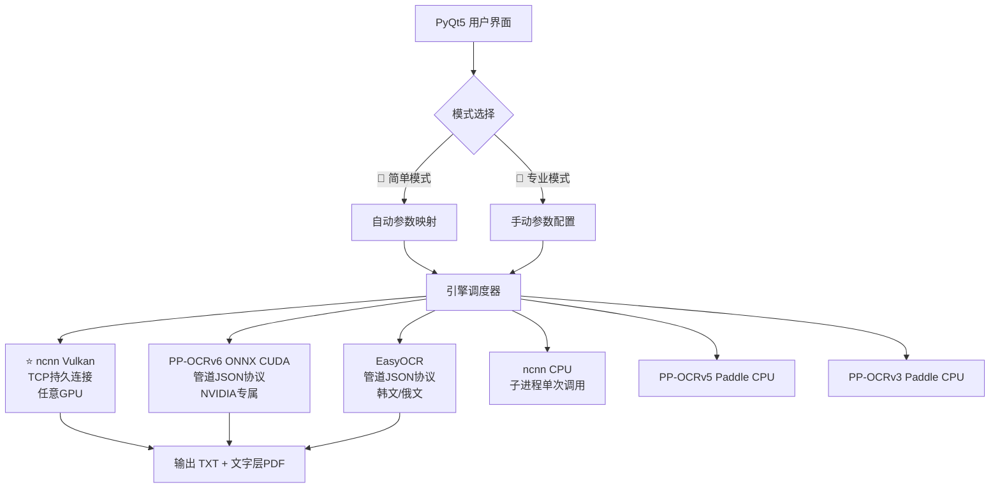

<div align="center">

# 🏛️ CathayOCR

**多引擎 GPU 加速 PDF 批量 OCR 工具**

*开箱即用 · 双击即开 · 专为古籍数字化设计*

[](LICENSE)
[]()
[]()
[]()

---

**把一叠 PDF 丢进去，几分钟后拿到整洁的电子文本。  
不需要安装 Python、CUDA 或任何运行环境。解压，双击，开干。**

</div>

---

## 📖 目录

- [为什么需要这个工具](#-为什么需要这个工具)
- [一分钟快速上手](#-一分钟快速上手)
- [版本选择](#-版本选择)
- [核心特性](#-核心特性)
- [引擎架构](#-引擎架构)
- [性能基准](#-性能基准)
- [系统要求](#-系统要求)
- [安装包下载](#-安装包下载)
- [从源码构建](#-从源码构建)
- [常见问题](#-常见问题)
- [技术栈](#-技术栈)
- [许可证与致谢](#-许可证与致谢)

---

## 🎯 为什么需要这个工具

你有一批古籍/文献的 **PDF 扫描件**，想把里面的文字提取出来变成可搜索、可复制、可编辑的文本文件？

传统的做法是：打开 PDF → 截图 → 一张张手动打字…… **太累了。**

CathayOCR 帮你全自动做完。你只需要告诉它哪几个 PDF 文件要处理，剩下的事它自己干。

```
157 页古籍校勘记 PDF
├─ 人工手打：4~6 小时
└─ CathayOCR：约 70 秒 ✅  （速度 ×200+）
```

### 谁在用？

| 角色 | 场景 |
|------|------|
| 📜 古籍研究者 | 校勘记、地方志、家谱、碑帖整理 |
| 🏛️ 图书馆/档案馆 | 批量扫描件数字化 |
| 👩‍🏫 文史师生 | 文献研究，需要可检索的文本版本 |
| 📖 文史爱好者 | 整理家谱、旧书、手稿 |
| 🌍 多语言工作者 | 法文、德文、日文、俄文、韩文、阿拉伯文等多语种 PDF |

---

## 🚀 一分钟快速上手

```bash
1. 下载安装包 → 解压到任意文件夹
2. 双击「启动.bat」
3. 等 10~30 秒，主界面弹出
4. 拖入 PDF 文件 → 点击「开始处理」
    （第一次用？左上角 🎯 简单模式已默认开启，回答 4 个问题即可）
```

> 💡 **首次使用建议**：保持「🎯 简单模式」勾选，依次回答文档类型、精度速度、显卡、语言，系统自动配好一切参数。

---

## 📦 版本选择

| 版本 | 压缩包大小 | 解压后 | OCR引擎 | 适合 |
|:---:|:---------:|:------:|:-------:|:----:|
|  **Lite** | **~630 MB** | ~2 GB | ncnn Vulkan（全GPU+CPU） | 🟢 小白、快速尝鲜 |
|  **Pro** | **~5.7 GB** | ~9 GB | 6引擎全量 + CUDA | 🔵 重度用户、学者 |
|  **Dev** | **~7.5 GB** | ~15 GB | 全量 + C++源码 + VS工程 | 🟣 开发者、学习研究 |

> 💡 **还没想好？先下 Lite 版。** 630 MB 解压即用，能覆盖 90% 的使用场景。觉得好用了再升级 Pro。

---

## ✨ 核心特性

### 🎯 双模式界面

| 🎯 简单模式 | 🔧 专业模式 |
|:-----------:|:----------:|
| 回答 4 个问题即可开跑 | 全部参数自由调节 |
| 文档类型 → 精度速度 → 显卡 → 语言 | 引擎、模型、批处理、双实例、GPU设备… |
| 10 秒完成配置 | 适合有经验的高级用户 |

### 🌐 75 种语言支持

| 语系 | 包含语言 |
|------|---------|
| **CJK** | 中文（繁简体自动）、日本語、한국어 |
| **西欧拉丁** | English、Français、Deutsch、Español、Italiano、Português… |
| **北欧/东欧** | Dansk、Svenska、Polski、Čeština、Magyar… |
| **西里尔文** | Русский、українська、беларуская、български…（13种） |
| **阿拉伯文系** | العربية、فارسی、ئۇيغۇرچە、اردو |
| **天城文系** | हिन्दी、नेपाली、संस्कृत |
| **东南亚** | ภาษาไทย、తెలుగు、தமிழ் |
| …以及希腊文、土耳其文、越南文等 **共 75 种** |

### ⚡ 高性能流水线

```
┌─ CPU 渲染线程 ─┐     ┌─ OCR 引擎线程 ─┐
│ PyMuPDF 预渲染   │ ──→ │ 6 引擎统一适配    │ ──→  输出文本
│ 多页并行        │     │ 双实例并发       │       + 带文字层PDF
│ 消除 I/O 瓶颈   │     │ GPU 永不等待     │
└─────────────────┘     └─────────────────┘
```

**设计理念**：CPU 在后台持续预渲染 PDF 页面并压入队列，OCR 引擎从队列中全速消费。GPU 永不等待，CPU 永不空闲。

### 🛡️ 军工级容错

- **超时保护**：单页 OCR 超过 180 秒自动跳过
- **安全定时器**：整体任务无进度超过 300 秒触发紧急停止
- **进程清理三保险**：SIGTERM → `taskkill /f` → `atexit` 兜底
- **快速取消**：直接终止子进程，秒级响应

### 🖥️ GPU 兼容性覆盖

| GPU | ncnn Vulkan | ONNX CUDA | 推荐引擎 |
|:---|:-----------:|:---------:|:--------:|
| NVIDIA RTX 系列 | ✅ | ✅（即插即用） | ncnn Vulkan（速度优势） |
| NVIDIA GTX 系列 | ✅ | ✅ | ncnn Vulkan |
| AMD Radeon RX 5000+ | ✅ | ❌ | ncnn Vulkan |
| Intel Arc A 系列 | ✅ | ❌ | ncnn Vulkan |
| 无独显/纯核显 | ✅（CPU回退） | ❌ | ncnn CPU |

---

## ⚙️ 引擎架构

CathayOCR 通过 **`ENGINE_REGISTRY`** 统一管理 6 个 OCR 引擎：



### 各引擎一句话总结

| 引擎 | 什么时候用 |
|------|-----------|
| ⭐ **ncnn Vulkan** | **默认首选**。速度最快，任意品牌显卡都能加速，没显卡自动切 CPU |
| **PP-OCRv6 ONNX CUDA** | 含阿拉伯文、天城文的多语种 PDF。便携版自带 CUDA DLL，即插即用 |
| **EasyOCR** | 韩文/俄文专用，识别效果优于 PP-OCR |
| **ncnn CPU / Paddle** | 备胎引擎，其他都用不了时顶上 |

---

## 📊 性能基准

**测试环境**：AMD Ryzen 7 8845H · NVIDIA RTX 5060 8GB · 32GB DDR5 · NVMe SSD · Windows 11 24H2

| 配置 | 页数 | 耗时 | 速度 | GPU利用率 |
|:----|:----:|:----:|:----:|:--------:|
| ⭐ ncnn Vulkan 双实例 FP16 v6 Medium | 157 | **~70 s** | **~2.2 p/s** | ~85% |
| PP-OCRv6 ONNX CUDA 单实例 v6 Medium | 160 | ~145 s | ~1.1 p/s | ~60% |
| ncnn CPU 单实例 FP32 v6 Medium | 100 | ~300 s | ~0.3 p/s | N/A |

> **实测数据**：157 页古籍校勘记 → 约 **70 秒** → 识别出约 **5 万字**。人工手打需要 4~6 小时。

---

## 💻 系统要求

| 项目 | 最低配置 | 推荐配置 |
|:----|:--------|:--------|
| **操作系统** | Windows 10 x64 1809+ | Windows 10/11 x64 |
| **内存** | 8 GB | 16 GB+ |
| **磁盘空间** | 根据版本 2~15 GB | SSD |
| **显卡** | 不需要（CPU可用） | NVIDIA RTX / AMD RX 5000+ / Intel Arc |
| **运行时** | **无需安装任何东西** | **无需安装任何东西** |

---

## 🔧 安装包下载

> 安装包体积较大（含完整 Python 环境 + CUDA 库 + OCR 模型），可通过以下渠道获取：

| 版本 | 格式 | 大小 | 下载 |
|:---:|:----:|:----:|:----:|
| **Lite 轻量版** | .zip | ~630 MB | [GitHub Releases](https://github.com/zzhjim02/CathayOCR/releases) |
| **Pro 专业版** | .zip | ~5.7 GB | 百度网盘（链接待更新） |
| **Dev 开发版** | .7z | ~7.5 GB | 百度网盘（链接待更新） |

> ℹ️ **为什么这么大？** 所有安装包都内含完整 Python 3.10 解释器、全部依赖库、CUDA/cuBLAS/cuDNN DLL（~2.4 GB）、OCR 模型（~1.7 GB），**真正做到解压即用，无需任何安装步骤。**

---

## 🔨 从源码构建

如果你只是想使用 CathayOCR，**无需从源码构建**——直接下载安装包即可。

但如果你对 OCR 引擎底层感兴趣，或想自定义编译 ncnn 引擎：

### 环境要求
- **Visual Studio 2022**（含 C++ 桌面开发工作负载）
- **CMake 3.20+**
- **Vulkan SDK 1.4+**（编译 Vulkan 版本时需要）
- **Python 3.10+**

### 构建 ncnn OCR 引擎

```bash
cd CathayOCR-Dev/ncnn

# 构建 CPU 版本
build_cpu.cmd

# 构建 Vulkan 版本
build_vulkan_and_deploy.cmd

# 构建 CPU + 自动部署
build_cpu_and_deploy.cmd
```

### 运行 Dev 版
```bash
cd CathayOCR-Dev
"CathayOCR Dev.bat"
```

---

## ❓ 常见问题

<details>
<summary><b>双击启动.bat 后黑框一闪而过？</b></summary>
解压不完整。确认 <code>portapython\python.exe</code> 文件存在，不要单独移动任何文件夹或修改目录结构。
</details>

<details>
<summary><b>Lite 版和 Pro 版选哪个？</b></summary>
<b>选 Lite 版就够了。</b>Lite 版用 ncnn Vulkan 引擎，支持任意品牌 GPU 加速，没显卡也能跑 CPU 模式。Pro 版多了 CUDA、EasyOCR 和 Paddle 备胎引擎，适合需要阿拉伯文/天城文识别，或想多引擎对比的用户。
</details>

<details>
<summary><b>进度不动了 / 卡住了？</b></summary>
点击「停止」→ 关掉程序 → 重新打开。如果频繁卡住：① 检查任务管理器有无残留 OCR 进程；② 调低批处理数；③ 换 ncnn CPU 引擎。
</details>

<details>
<summary><b>识别结果很多错字？</b></summary>
① 渲染倍率调到 3x；② 图像边长调到 3000；③ 模型选 v6 Server；④ 确认语言选择正确。
</details>

<details>
<summary><b>速度太慢怎么办？</b></summary>
① 确认模式选了"自动"或"GPU模式"；② 开启「双实例并行」；③ 精度选 FP16；④ 调低渲染倍率到 1x。
</details>

<details>
<summary><b>和 Umi-OCR 有什么区别？</b></summary>
Umi-OCR 更适合单张图片或少量文字的识别。CathayOCR 是专为<b>大量 PDF 文件批量处理</b>设计的，多了自动流水线、双实例并行加速、GPU 设备选择、简单模式等功能，批处理效率高得多。
</details>

---

## 🛠️ 技术栈

| 组件 | 技术 |
|:----|:----|
| **GUI 框架** | PyQt5 |
| **PDF 渲染** | PyMuPDF (MuPDF) |
| **主力 OCR 引擎** | PP-OCR via ncnn (C++) / ONNX Runtime (CUDA) |
| **备选 OCR** | Paddle Inference / EasyOCR (PyTorch) |
| **GPU 加速** | Vulkan (ncnn) / CUDA (ONNX Runtime) |
| **便携 Python** | Embedded Python 3.10 (portapython) |
| **C++ 构建** | CMake + Visual Studio 2022 |

---

## 📜 许可证与致谢

**许可证**：[GPLv3](LICENSE)

本项目基于以下优秀开源项目构建，在此表示诚挚感谢：

| 项目 | 用途 | 许可 |
|:----|:----|:----:|
| [Umi-OCR](https://github.com/hiroi-sora/Umi-OCR) | OCR 管道架构参考 | MIT |
| [PaddleOCR](https://github.com/PaddlePaddle/PaddleOCR) | OCR 模型训练框架 | Apache 2.0 |
| [ncnn](https://github.com/Tencent/ncnn) | 高性能神经网络推理框架 | BSD 3-Clause |
| [ppocr-ncnn-cpp](https://github.com/CrumpetTurtle/ppocr-ncnn-cpp) | ncnn OCR 引擎 C++ 实现 | |
| [PyMuPDF](https://github.com/pymupdf/PyMuPDF) | PDF 渲染引擎 | AGPL |
| [PyQt5](https://riverbankcomputing.com/software/pyqt/) | GUI 框架 | GPL |
| [EasyOCR](https://github.com/JaidedAI/EasyOCR) | 多语言 OCR 引擎 | Apache 2.0 |

---

<div align="center">

**如果这个工具帮到了你，欢迎 ⭐ Star 支持！**

[]()
[]()

*用 AI 为古籍续命，让历史不那么容易被遗忘。*

</div>
