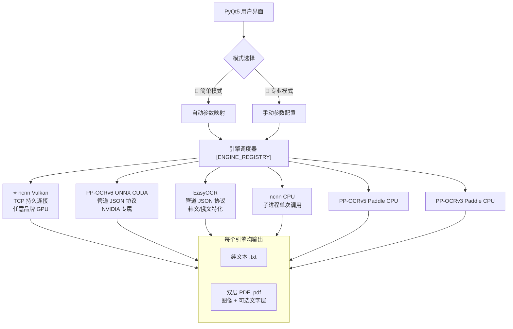

<div align="center">

# 🏛️ CathayOCR

**多引擎 GPU 加速 PDF 批量 OCR 工具**

*开箱即用 · 双击即开 · 专为古籍数字化设计*

[](LICENSE)
[]()
[]()
[]()

---

**打开安装包 → 双击启动 → 拖入 PDF → 开始处理，几分钟后拿到整洁的双层 PDF 和纯文本文件。**

你不需要安装 Python、CUDA 或任何开发环境。甚至不需要知道什么是 OCR。

</div>

> 🟢 **稳定版 v1.2.4** —— 经过长期验证，推荐**绝大多数用户**使用 👉 [⬇️ 下载 v1.2.4](https://github.com/zzhjim02/CathayOCR/releases/tag/v1.2.4)
>
> 🟡 **测试版 v1.3.5（最新）** —— 新增多引擎、多语言修正、引擎恢复与完整性改进，**仍在测试中**，尝鲜 / 协助测试可选 👉 [⬇️ 下载 v1.3.5](https://github.com/zzhjim02/CathayOCR/releases/tag/v1.3.5)
>
> ⚠️ 如果你使用的是 **v1.2.3 及更早版本**，请务必更新：v1.2.4 修复了「除 Vulkan 外其他引擎全部不可用」等严重问题。
---

## 🔗 Cathay 人文社科工具链

这是一整套给人文社科研究者用的**本地**工具：从「找到一本书」，到「把它变成能搜、能读、能引用的 PDF」，再到「在上万本书里一秒检索」——每一步一个小程序，**各自独立，只挑你用得上的那一步就行**。

| 步骤 | 工具 | 一句话 | 版本 |
|:---:|---|---|---|
| ⓪ | [CathayRepair](https://github.com/zzhjim02/CathayRepair) | PDF 打不开、一翻就崩 → 先把它抢救回来 | v1.0.0 |
| ① | [CathayPDG](https://github.com/zzhjim02/CathayPDG) | 读秀 / 超星的 PDG 压缩包 → PDF | v0.2.0 |
| **②** | **CathayOCR（你在这里）** | 扫描件做 OCR → 能搜索、能复制的 PDF | **v1.2.4 稳定 / v1.3.5 测试** |
| ③ | [CathayRestore](https://github.com/zzhjim02/CathayRestore) | 把 OCR 出来的 TXT 写回 PDF，做成双层 | v1.0.0 |
| ④ | [CathayExtract](https://github.com/zzhjim02/CathayExtract) | 已经是双层 PDF → 直接把文字抽成 TXT | v1.2.3 |
| ⑤ | [CathayShelf](https://github.com/zzhjim02/CathayShelf) | 批量建档归位、规范命名、繁简转换 | v0.4.8 |
| ⑥ | [CathayFinder](https://github.com/zzhjim02/CathayFinder) | 11 个渠道查这本书在哪（找书号 / 找路径） | v1.1.0 |
| ⑦ | [CathayHub](https://github.com/zzhjim02/CathayHub) | **索引 + 全库检索 + 浏览阅读，四合一的日常入口** | v0.3.16 |

> 🧭 **最常用的一条线**：⑥ 查到书 → ① 转成 PDF → ② 让它能搜 → ⑤ 著录归架 → ⑦ 检索、翻开。
> 每一步都能单独用，不强制串起来；整套**纯本地、不联网、不动你的原件**。

**已成历史（功能已并入后面的工具，代码还能跑）**

| 工具 | 现状 |
|---|---|
| [CathayIndex](https://github.com/zzhjim02/CathayIndex) | 已并入 ⑥ CathayFinder 的「本地文件库索引」页签，以及 ⑦ CathayHub Indexer |
| [CathayViewer](https://github.com/zzhjim02/CathayViewer) | 已并入 ⑦ CathayHub Viewer |
| [CathayReader](https://github.com/zzhjim02/CathayReader) | 已由 ⑦ CathayHub Viewer 取代 |
| [CathaySimplify](https://github.com/zzhjim02/CathaySimplify) | 已并入 ⑤ CathayShelf 的「繁简转换 / 编码规范化」 |

**🛠️ 备用小工具（不占主线，按需取用）**

| 工具 | 什么时候想到它 |
|---|---|
| [CathayDir](https://github.com/zzhjim02/CathayDir)（[📥 Releases](https://github.com/zzhjim02/CathayDir/releases/latest)） | 成批 PDF 摆在那儿，想先知道各自是**横排还是竖排**（分流做 OCR、挑引擎参数、建库前摸底）—— 每 10 页抽一页批量判，结果能存 CSV，也能直接分成「横排 / 竖排 / 未知」三个柜。判定算法借自 CathayPDG |

---


## 📖 目录

- [这个仓库是什么？](#-这个仓库是什么)
- [你需要下载哪个？](#-你需要下载哪个)
- [为什么需要这个工具](#-为什么需要这个工具)
- [一分钟快速上手](#-一分钟快速上手)
- [版本详解](#-版本详解)
- [核心特性](#-核心特性)
- [引擎架构](#-引擎架构)
- [性能基准](#-性能基准)
- [系统要求](#-系统要求)
- [安装包下载](#-安装包下载)
- [从源码构建 / 修改](#-从源码构建--修改)
- [常见问题](#-常见问题)
- [技术栈与上游项目](#-技术栈与上游项目)
- [许可证](#-许可证)

---

## ❗ 这个仓库是什么？

> **⚠️ 重要提示：GitHub 上的这个仓库只包含 Python 源码（.py）和 C++ 引擎源码（.cpp/.h）。**
>
> **OCR 模型、CUDA 库、便携 Python 等二进制文件因体积过大（单文件最大 637 MB）且超过 GitHub 单个文件 100 MB 的限制，不包含在此仓库中。**
>
> ⬇️ **要直接使用 CathayOCR，请到下方的 [安装包下载](#-安装包下载) 区域下载完整的 Lite / Pro / Dev 安装包。** 那些安装包才是"解压即用"的——它们包含了所有依赖、模型和运行环境。

---

## 🎯 你需要下载哪个？

| 你的身份 | 下载这个 | 理由 |
|:--------|:--------|:------|
| 🟢 **普通用户 / 学者**——识别中文等常见语言 | **Lite 轻量版** | 630 MB，解压即用，多数语言的精度为最高 |
| 🔵 **重度用户**——需阿拉伯文 / 天城文 / 多引擎对比 | **Pro 专业版** | 6 引擎全量 + CUDA GPU 加速 |
| 🟣 **开发者**——想研究 / 修改代码 | **DEV 开发版** | 完整 Python + C++ 源码，全套开发环境 |
| 🟡 **只想改改代码不想装环境** | 任何一个安装包 | .py 文件用记事本就能直接改，改完双击运行 |

> 每个安装包本质上就是一个**完整的项目文件夹**——里面的 Python 脚本、C++ 可执行文件、配置文件都可以直接修改。修改完后重新运行 `启动.bat` 即可看到效果。

---

## 🎯 为什么需要这个工具

你有一批古籍 / 文献的 **PDF 扫描件**，想把里面的文字提取出来变成可搜索、可复制、可编辑的文件？

传统的做法是：打开 PDF → 截图 → 一张张手动打字…… **太累了。**

CathayOCR 帮你全自动做完。你只需要告诉它哪几个 PDF 文件要处理，剩下的事它自己干。

```
157 页古籍校勘记 PDF
├─ 人工手打：4~6 小时
└─ CathayOCR：约 70 秒 ✅  （速度 ×200+）
```

### 谁在用？

| 角色 | 场景 |
|:-----|:-----|
| 📜 **古籍研究者** | 校勘记、地方志、家谱、碑帖整理 |
| 🏛️ **图书馆 / 档案馆** | 批量扫描件数字化 |
| 👩‍🏫 **文史师生** | 文献研究，需要可检索的文本版本 |
| 📖 **文史爱好者** | 整理家谱、旧书、手稿 |
| 🌍 **多语言工作者** | 法文、德文、日文、俄文、韩文、阿拉伯文等多语种 PDF |

---

## 🚀 一分钟快速上手

```bash
1. 下载 Lite 或 Pro 安装包 → 解压到任意文件夹（建议 SSD）
2. 双击文件夹里的「启动.bat」
3. 等 10~30 秒，主界面弹出
4. 拖入 PDF 文件 → 点击「开始处理」
```

> 💡 **首次使用建议**：界面左上角「🎯 简单模式」默认勾选，依次回答文档类型、精度速度、显卡、语言这四个问题，系统自动配好一切参数。10 秒完成设置。

---

## 📦 版本详解

### Lite 轻量版（~630 MB .zip | 解压 ~2 GB）

一个引擎，极致精简。**适合所有用户——尤其是中文古籍和大多数学者。**

| 项目 | 说明 |
|:----|:------|
| **引擎** | ⭐ **ncnn Vulkan**（跨品牌 GPU 加速，无 GPU 自动回退 CPU） |
| **模型** | PP-OCR v5/v6 轻量模型 + v5 Server 模型 |
| **GPU 支持** | NVIDIA / AMD / Intel 任意品牌独立显卡 |
| **CPU 支持** | ✅ 无独显也能跑 |
| **语言** | **~65 种**（V6 字典：CJK、拉丁、西里尔、希腊等） |
| **识别精度** | **多数语言为最高**（ncnn Vulkan 同模型下字符检出率略高于 ONNX CUDA） |
| **依赖** | 便携 Python + 基础依赖库 |
| **适合** | **所有用户，尤其中文学者。对大多数语言来说精度和速度都是最优选择** |

> 💡 **对大多数学者来说 Lite 版就够了**——尤其是中文古籍和大多数欧洲语言。Lite 版使用 V6 字典覆盖约 **65 种语言**（含 CJK、拉丁语系、西里尔文、希腊文），ncnn Vulkan 引擎的精度和速度都是最优的。
>
> ⚠️ Lite **不包含**阿拉伯文、天城文（印地/梵文）、泰文等 V5 语系识别。如有这些需求请使用 Pro 版。

### Pro 专业版（~5.7 GB .zip | 解压 ~9 GB）

六引擎全量。适合需要多语种（阿拉伯文、天城文等）或多引擎对比的用户。

| 项目 | 说明 |
|:----|:------|
| **引擎** | ncnn Vulkan + PP-OCRv6 ONNX CUDA + EasyOCR + ncnn CPU + PP-OCRv5 + PP-OCRv3 |
| **模型** | v3~v6 全套模型 + EasyOCR 多语种模型 + V5 分语系 ONNX 模型（阿拉伯、天城文等） |
| **CUDA 支持** | ✅ 便携版自带 CUDA/cuBLAS/cuDNN DLL（~2.4 GB），即插即用，无需安装 NVIDIA CUDA 工具包 |
| **语言** | **75 种**（含阿拉伯文、天城文、东南亚文字等） |
| **适合** | 需要阿拉伯文、天城文识别，或想在不同引擎间对比效果的用户 |

> 💡 <b>无头服务器（无固态GPU、无 Vulkan/CUDA 支持）</b>：此类问题一般只出现在无头服务器上，家用电脑不会有。
> 大多数这类设备用 Lite 版的 ncnn CPU 引擎（V6）就能跑，前提是先按本页 FAQ 做好修改（关闭 Vulkan 模式等）。
> 如果修改后 V6 仍无法运行（CPU 架构过于古老），Pro 版还有一个老兼容引擎「PP-OCRv5 Paddle CPU」（引擎列表最下方），纯 CPU 运行，这种极低配置下也能正常使用。不用的引擎文件夹可以直接删除。

### DEV 开发版（~7.5 GB .7z | 解压 ~15 GB）

> **这是给开发者准备的版本。** 它包含了 Lite 和 Pro 的所有内容，外加：

| 项目 | 说明 |
|:----|:------|
| **C++ OCR 引擎完整源码** | ncnn 引擎全部 C++ 源码（10 个文件），可使用 Visual Studio 2022 编译 |
| **CMake 构建系统** | 支持 CPU / Vulkan 两种编译配置 |
| **VS2022 工程文件** | 解压后可直接在 Visual Studio 中打开编译 |
| **Vulkan SDK 安装包** | 编译 Vulkan 版本所需（亦可自行下载新版） |
| **ncnn 完整源码** | ncnn 框架源码（含 git 历史），方便修改底层推理引擎 |
| **多套 Python 虚拟环境** | EasyOCR 环境、Surya OCR 实验环境等，方便开发测试 |
| **多语种测试 PDF** | 8 种语言的测试用 PDF 样本 |
| **开发工具脚本** | 模型下载脚本、引擎注册脚本、性能测试脚本等 |

> 💡 **DEV 版本身也是一个完整可用的 OCR 工具**——它和 Pro 版一样包含全部引擎和依赖，解压后双击 `启动.bat` 也能直接使用。

---

## ✨ 核心特性

### 🎯 双模式界面

| 🎯 简单模式 | 🔧 专业模式 |
|:-----------:|:----------:|
| 回答 4 个问题即可开跑 | 全部参数自由调节 |
| 文档类型 → 精度速度 → 显卡 → 语言 | 引擎、模型、批处理、双实例、GPU 设备… |
| 10 秒完成配置 | 适合有经验的高级用户 |

### 🌐 多语言支持

> **Lite 版**覆盖 **~65 种语言**（V6 字典：CJK、拉丁语系、西里尔文、希腊文等）。
> **Pro 版**额外增加 V5 分语系 ONNX 模型和 EasyOCR，总计 **~75 种**。

**Lite / Pro 均支持（V6 通用字典）：**

| 语系 | 包含语言 |
|:-----|:---------|
| **CJK** | 中文（繁简体自动）、日本語、한국어 |
| **西欧拉丁** | English、Français、Deutsch、Español、Italiano、Português… |
| **北欧 / 东欧** | Dansk、Svenska、Polski、Čeština、Magyar… |
| **西里尔文** | Русский、українська、беларуская、български…（13 种） |
| **希腊 / 土耳其 / 越南** | Ελληνικά、Türkçe、Tiếng Việt… |
|…以及其他拉丁语系语言 |共 **~65 种** |

**仅 Pro 版支持（V5 分语系 ONNX + EasyOCR）：**

| 语系 | 包含语言 | 引擎 |
|:-----|:---------|:----:|
| **阿拉伯文系** | العربية、فارسی、ئۇيغۇرچە、اردو | PP-OCRv6 ONNX CUDA |
| **天城文系** | हिन्दी、नेपाली、संस्कृत | PP-OCRv6 ONNX CUDA |
| **东南亚** | ภาษาไทย、తెలుగు、தமிழ் | PP-OCRv6 ONNX CUDA |
| **韩文 / 俄文（增强）** | EasyOCR 专用模型辅助提升 | EasyOCR |
| **…** | 合计约 **+10 种** | — |

### ⚡ 高性能流水线

```
┌─ CPU 渲染线程 ─┐     ┌─ OCR 引擎线程 ─┐
│ PyMuPDF 预渲染   │ ──→ │ 6 引擎统一适配    │ ──→  ├─ 原文件名_result.txt
│ 多页并行        │     │ 双实例并发       │       └─ 原文件名_layered.pdf
│ 消除 I/O 瓶颈   │     │ GPU 永不等待     │            （图像+文本双层）
└─────────────────┘     └─────────────────┘
```

**设计理念**：CPU 在后台持续预渲染 PDF 页面并压入队列，OCR 引擎从队列中全速消费。GPU 永不等待，CPU 永不空闲。

**输出文件**：每个 PDF 处理完成后生成两个文件：
- `原文件名_result.txt` — 纯文本识别结果
- `原文件名_layered.pdf` — **图像+文本双层 PDF**，可在其中选中、复制、搜索文字

### 🛡️ 军工级容错

- **超时保护**：单页 OCR 超过 180 秒自动跳过
- **安全定时器**：整体任务无进度超过 300 秒触发紧急停止
- **进程清理三保险**：SIGTERM → `taskkill /f` → `atexit` 兜底
- **快速取消**：直接终止子进程，秒级响应

### 🖥️ GPU 选型建议

| 你的显卡 | 推荐引擎 | 理由 |
|:---------|:--------|:------|
| **NVIDIA 显存 ≥ 8 GB**（如 RTX 3060/4060/5060 及以上） | ONNX CUDA 或 **ncnn Vulkan 双实例** | 显存充裕时 ONNX CUDA 精度优；ncnn Vulkan 双实例速度最快 |
| **NVIDIA 显存 ≤ 8 GB**（如 RTX 3050/4050） | ⭐ **ncnn Vulkan 双实例** | 双实例速度翻倍，不爆显存 |
| **AMD Radeon / Intel Arc 独显** | ⭐ **ncnn Vulkan 双实例** | 唯一 GPU 加速选项，效果很好 |
| **无独显 / 纯核显** | **ncnn CPU** | 兼容稳定 |

> 💡 **还不知道怎么选？** 开「🎯 简单模式」→ 显卡选「我不知道」→ 系统自动检测最优配置。

---

## ⚙️ 引擎架构

CathayOCR 通过 **`ENGINE_REGISTRY`** 统一管理 6 个 OCR 引擎。**所有引擎均输出 TXT + 双层 PDF**：


```mermaid
graph TD
    UI[PyQt5 用户界面] --> SM{模式选择}
    SM -->|🎯 简单模式| Auto[自动参数映射]
    SM -->|🔧 专业模式| Manual[手动参数配置]
    Auto --> Engine["引擎调度器 [ENGINE_REGISTRY]"]
    Manual --> Engine

    Engine --> NCNN[⭐ ncnn Vulkan<br/>TCP 持久连接<br/>任意品牌 GPU]
    Engine --> ONNX[PP-OCRv6 ONNX CUDA<br/>管道 JSON 协议<br/>NVIDIA 专属]
    Engine --> EOCR[EasyOCR<br/>管道 JSON 协议<br/>韩文/俄文特化]
    Engine --> CPU[ncnn CPU<br/>子进程单次调用]
    Engine --> V5[PP-OCRv5 Paddle CPU]
    Engine --> V3[PP-OCRv3 Paddle CPU]

    subgraph 输出 [每个引擎均输出]
        Out1[纯文本 .txt]
        Out2[双层 PDF .pdf<br/>图像 + 可选文字层]
    end

    NCNN --> 输出
    ONNX --> 输出
    EOCR --> 输出
    CPU --> 输出
    V5 --> 输出
    V3 --> 输出
```

### 各引擎一句话总结

| 引擎 | 什么时候用 |
|:-----|:-----------|
| ⭐ **ncnn Vulkan** | **默认首选**。速度最快，任意品牌显卡都能加速，没显卡自动切 CPU。**多数语言精度最高** |
| **PP-OCRv6 ONNX CUDA** | 含阿拉伯文、天城文的多语种 PDF。显存 ≥ 8 GB 时推荐。便携版自带 CUDA DLL，即插即用 |
| **EasyOCR** | 韩文 / 俄文专用，识别效果优于 PP-OCR |
| **ncnn CPU / Paddle CPU** | 备胎引擎，其他都用不了时顶上 |

---

## 📊 性能基准

**测试环境**：AMD Ryzen 7 9700X · NVIDIA RTX 5060 8GB · 32GB DDR5 · NVMe SSD · Windows 11 24H2

| 配置 | 页数 | 耗时 | 速度 | GPU 利用率 |
|:----|:----:|:----:|:----:|:----------:|
| ⭐ **ncnn Vulkan 双实例 FP16 v6 Medium** | 157 | **~70 s** | **~2.2 p/s** | ~85% |
| PP-OCRv6 ONNX CUDA 单实例 v6 Medium | 160 | ~145 s | ~1.1 p/s | ~60% |
| ncnn CPU 单实例 FP32 v6 Medium | 100 | ~300 s | ~0.3 p/s | N/A |

> **实测数据**：157 页古籍校勘记 → 约 **70 秒** → 识别出约 **5 万字**。人工手打需要 4~6 小时。
>
> **字符覆盖率**：ncnn Vulkan 比 ONNX CUDA 略高（101.4% vs 100%），属于检测框分割策略差异。CUDA 版对表格和校勘条目（「○」「□」）识别更稳定。

---

## 🖥️ 系统要求

| 项目 | 最低配置 | 推荐配置 |
|:----|:--------|:--------|
| **操作系统** | Windows 10 x64（Win7/8 未经测试，理论可运行） | Windows 10/11 x64 |
| **CPU** | x64 处理器，单核以上（已验证双线程可用） | 多核处理器 |
| **内存** | 2 GB（已验证）/ 1 GB（理论可行，未测试） | 16 GB+ |
| **磁盘空间** | 机械硬盘可用，空闲 2~15 GB | SSD |
| **显卡** | 不需要 | NVIDIA RTX / AMD RX 5000+ / Intel Arc |
| **运行时** | **无需安装任何东西** | **无需安装任何东西** |

---
## 🏛️ 安装包下载

> 安装包内含 **完整 Python 3.10 + 全部依赖 + CUDA DLL + OCR 模型**，解压即用，无需任何安装步骤。

---

### 🚀 推荐下载

> 📌 **两个版本，按需选择：**
>
> | | 版本 | 说明 |
> |:--:|:--|:--|
> | 🟢 | **v1.2.4 稳定版** | 经过长期验证，**推荐绝大多数用户** |
> | 🟡 | **v1.3.5 测试版（最新）** | 新增多引擎、多语言修正、引擎恢复与完整性改进；**仍在测试中**，尝鲜 / 协助测试可选 |

---

#### 🟡 v1.3.5 测试版（最新）

> 📌 **v1.3.5 更新**：在 v1.2.4 基础上引入多引擎架构（PP-OCRv6 ONNX CUDA / PP-OCRv5 / PP-OCRv3 / EasyOCR / ncnn CPU 等）、多语言路由修正（西里尔、韩、阿、天城、泰等）、引擎恢复三级策略与「丢页闸门」完整性保护，并修复大量稳定性问题。**本版仍在测试中**，如遇问题欢迎反馈。

| 版本 | 大小 | 下载 |
|:--|:--|:--|
| **① Lite 轻量版** | ~650 MB（.zip） | [⬇️ GitHub Releases](https://github.com/zzhjim02/CathayOCR/releases/tag/v1.3.5) · [📦 百度网盘](https://pan.baidu.com/s/13NbKzXrBq1ooR5rc2M-0uQ?pwd=2026)（密码 2026） |
| **② Pro 专业版** | ~5.0 GB（.7z） | [📦 百度网盘](https://pan.baidu.com/s/13NbKzXrBq1ooR5rc2M-0uQ?pwd=2026)（密码 2026） |

> 💡 Lite 轻量版同时上传到 GitHub Releases；Pro 专业版体积较大（~5 GB .7z），仅通过网盘分发。

---

#### 🟢 v1.2.4 稳定版（推荐）

> 📌 **v1.2.4 更新**：修复除 ncnn Vulkan 外其他引擎全部不可用的问题（Pro / Dev）——此前选 PP-OCRv6 / PP-OCRv5 / 经典版 / ncnn CPU / EasyOCR 处理，导出结果没有文字。Lite 仅有 Vulkan 引擎，不受影响。详见下方 [v1.2.4 更新说明](#-v124-更新说明)。

##### ① Lite 轻量版（~640 MB）← 大多数人选这个！
适合识别中文、日文、韩文等常见语言，开箱即用。

| 下载方式 | 链接 |
|:-------|:-----|
| 📦 **中国移动云盘**（推荐） | [点击下载](https://yun.139.com/shareweb/#/w/i/2xop1H8ckR7b0) |
| 📦 **百度网盘**（备用，密码 2026） | [点击下载](https://pan.baidu.com/s/1gHGWonDz2RvQfsUGikYiYA?pwd=2026) |
| ⬇️ **GitHub Releases** | [点击下载](https://github.com/zzhjim02/CathayOCR/releases/tag/v1.2.4) |

##### ② Pro 专业版（~5.8 GB）
需要识别阿拉伯文、天城文等稀有语言，或需要多引擎对比时选这个。

| 下载方式 | 链接 |
|:-------|:-----|
| 📦 **中国移动云盘**（推荐） | [点击下载](<PRO_139_LINK_PLACEHOLDER>) |
| 📦 **百度网盘**（备用，密码 2026） | [点击下载](<PRO_BAIDU_LINK_PLACEHOLDER>) |

##### ③ DEV 开发版（~10 GB）
如果你想研究或修改代码，选这个（含全套源码和开发工具）。

| 下载方式 | 链接 |
|:-------|:-----|
| 📦 **百度网盘**（密码 2026） | [点击下载](<DEV_BAIDU_LINK_PLACEHOLDER>) |
| 📦 **中国移动云盘** | [点击下载](<DEV_139_LINK_PLACEHOLDER>) |

---

## 🆕 v1.3.5 更新说明（测试版）

> 发布日期：2026-10-10 ｜ 状态：**测试版**（建议与 v1.2.4 稳定版并存）

**在 v1.2.4 基础上，本次更新集中在「多引擎、多语言、稳定性与结果完整性」：**

1. **多引擎架构** — UI 统一管理 6 个引擎：ncnn Vulkan / PP-OCRv6 (ONNX CUDA) / PP-OCRv5 (Paddle CPU) / PP-OCRv3 (Paddle CPU) / EasyOCR / ncnn CPU（Pro）。简单模式按「文档类型 → 精度速度 → 显卡 → 语言」自动配好参数。
2. **多语言修正** —
   - 西里尔（俄 / 乌 / 保）等在**任意显卡**上都会正确切到 Paddle CPU 分语种模型（此前无论什么显卡都只加载中 / 英 / 日字典 → 输出乱码）；
   - 韩文 / 俄文自动回退官方 **PP-OCRv5 分语种模型**（PP-OCRv6 单模型仅覆盖 50 语种，不含韩文 / 西里尔）；
   - 补齐普什图 / 信德 / 克什米尔 / 俾路支 / 博杰普尔 / 迈蒂利 / 孔卡尼等字母系语言，win7_v5 语种路由扩至 33 组。
3. **引擎恢复三级策略 + 看门狗自愈** — 双实例轮询分页；明确区分「有文字 / 明确空白 / 引擎层错误 / 不可用」，仅在真故障时重启，避免误杀。
4. **「丢页闸门」完整性保护**（本版重点）— 只要有任一页未被成功识别，就整份文件重跑；重试用尽仍不完整则**直接报错并写出警告文件**，绝不交付「少页看不出」的结果。
5. **诊断增强** — 引擎 stderr 落盘、运行日志分级（保留全部细节，但不刷屏）。
6. **GPU 卡死（TDR）应对** — 随包附 `GPU卡死修复_调大TDR超时_需重启.reg`：Windows 默认 2 秒 TDR 超时可能误杀长耗时任务，管理员运行该 .reg 并重启可调大超时。

> ⚠️ 本版为**测试版**，建议与 v1.2.4 稳定版同时保留，日常主力仍可继续用 v1.2.4。

---

## 🆕 v1.2.4 更新说明

> 发布日期：2026-09-11

**一个严重 Bug 修复（仅影响 Pro / Dev）：**

1. **修复「除 Vulkan 外其他引擎全部不可用」** — 选用 PP-OCRv6 (ONNX CUDA) / PP-OCRv5 / 经典版 / ncnn CPU / EasyOCR 时，引擎能启动、界面也不报错，但导出结果**没有任何文字**：`_result.txt` 只有文件头、`_layered.pdf` 里没有文字层。原因是 OCR 消费线程调用了**只存在于 Vulkan 适配器**上的 `get_dynamic_timeout()` → 非 Vulkan 引擎立刻抛 `AttributeError`，且该调用位于 `try` 之外，线程当场死亡、页面永远不会被识别。

**修复内容：**

- 把 `get_dynamic_timeout()` 与 `restart()` 提升到基类 `OCREngineAdapter` 提供通用实现（聚合耗时样本：不足 3 个返回 180s，否则按 p90×3 升档、上限 300s）；`NcnnVulkanAdapter` 保留自身实现，**Vulkan 行为零变化**
- `PaddlePipeAdapter` / `NcnnCPUAdapter` 同样记录每页耗时 → 「慢设备自动升档超时」与看门狗自愈对**所有引擎**生效
- `ocr_consumer` 调用处加 `getattr` 兜底，避免同类崩溃再次发生

**验证**：6 引擎真机端到端回归全部通过 —— PP-OCRv6 42 字 / PP-OCRv5 42 字 / 经典版 41 字 / ncnn CPU 42 字 / EasyOCR 88 字 / ncnn Vulkan 正常。

> 📌 **说明**：该缺陷源自 v1.1.3 的看门狗实现（v1.2.3 未触及），因此自 v1.1.3 起，除 Vulkan 外的引擎实际上一直不可用。**Lite 轻量版只有 ncnn Vulkan 引擎，不受影响。**

---

## 🆕 v1.2.3 更新说明

> 发布日期：2026-08-27

**三个 Bug 修复 + 两个新功能：**

1. **修复「竖排识别」无效 Bug** — 原「竖排文字」选项是无效开关（参数链路从未被引擎使用），竖排古籍结果始终按横排顺序输出。现在勾选「竖排识别」后按中心点 X 降序（右→左）、Y 升序（上→下）重排，纯 CPU 后处理 <10ms。选项更名为「**竖排识别**」，默认不勾选。

2. **修复竖排文字写不进 PDF / 搜索不到** — 竖排古籍检测框为竖条框（高>宽），但导出时文字按横排写入 → 长句横向展开超出页面右边界，被查看器裁剪丢弃，PDF 搜不到、缺字。现在竖条框以 **rotate=270 从框顶向下竖排写入**，整句完整落在页面内可正常搜索。与「竖排识别」勾选联动。

3. **修复 OCR 坐标超界 Bug** — OCR 返回 scale=2 渲染图像的像素坐标，写入 PDF 前未 ÷scale → 文字落页面外无法提取/搜索。已修复：`x0/=scale; y0/=scale; x2/=scale; y2/=scale`。

4. **新增「覆盖旧OCR」功能** — 勾选后导出双层 PDF 时物理删除原 PDF 全部旧文字层（PyMuPDF Redaction，保留图像层与矢量图形），只叠加本次新识别文字层，Ctrl+F 可正常搜索。

5. **新增 TXT 文本层写回工具 v1.1** — 批量修复「双层 PDF 无法搜索」问题的独立小工具：把 OCR 结果 TXT 按页写回 PDF 替换错误旧层。竖排古籍风格排版、透明可搜索文字、多核并行（默认 4 线程）、递归扫描子目录。位于安装包 `TXT写回工具\` 目录，双击 `启动工具.bat` 运行。

> ⚠️ **注意**：竖排古籍请勾选「竖排识别」；替换旧层请勾选「覆盖旧OCR」。两选项默认均不勾选。

---

### 📦 旧版本

#### v1.2.3

| 版本 | 百度网盘 | GitHub |
|------|----------|--------|
| **Lite 轻量版** | [下载](https://pan.baidu.com/s/1gHGWonDz2RvQfsUGikYiYA?pwd=2026) | [v1.2.3](https://github.com/zzhjim02/CathayOCR/releases/tag/v1.2.3) |
| **Pro 专业版** | [下载](https://pan.baidu.com/s/1tuSx3pgD9V-0XfJTDDbymg?pwd=2026) | [v1.2.3](https://github.com/zzhjim02/CathayOCR/releases/tag/v1.2.3) |
| **Dev 开发版** | [下载](https://pan.baidu.com/s/18vdi-q3Uh_GfWzH3_YVYRw?pwd=2026) | [v1.2.3](https://github.com/zzhjim02/CathayOCR/releases/tag/v1.2.3) |

#### v1.1.3

| 版本 | 百度网盘 | GitHub |
|------|----------|--------|
| **Lite 轻量版** | [下载](https://pan.baidu.com/s/11O7OGe3CKDYp3cUtkpkNaw?pwd=2026) | [v1.1.3](https://github.com/zzhjim02/CathayOCR/releases/tag/v1.1.3) |
| **Pro 专业版** | [下载](https://pan.baidu.com/s/165w3HUiuPF2DfogWJQh-Hg?pwd=2026) | [v1.1.3](https://github.com/zzhjim02/CathayOCR/releases/tag/v1.1.3) |
| **Dev 开发版** | [下载](https://pan.baidu.com/s/1B7sWYaQ-c3H3IQKl4UYWMw?pwd=2026) | [v1.1.3](https://github.com/zzhjim02/CathayOCR/releases/tag/v1.1.3) |

#### v1.1.2

| 版本 | 百度网盘 | GitHub |
|------|----------|--------|
| **Lite 轻量版** | [下载](https://pan.baidu.com/s/1ieMGyO6Wdtgnm-NbaVBGpw?pwd=2026) | [v1.1.2](https://github.com/zzhjim02/CathayOCR/releases/tag/v1.1.2) |
| **Pro 专业版** | [下载](https://pan.baidu.com/s/15kyLbXZfXdlRQyox4-ztig?pwd=2026) | [v1.1.2](https://github.com/zzhjim02/CathayOCR/releases/tag/v1.1.2) |
| **Dev 开发版** | [下载](https://pan.baidu.com/s/1B7sWYaQ-c3H3IQKl4UYWMw?pwd=2026) | [v1.1.2](https://github.com/zzhjim02/CathayOCR/releases/tag/v1.1.2) |

#### v1.1.0

| 版本 | 百度网盘 | GitHub |
|------|----------|--------|
| **Lite 轻量版** | [下载](https://pan.baidu.com/s/1gOnx5RE21N_lfLryxtKsxw?pwd=2026) | [v1.1.0](https://github.com/zzhjim02/CathayOCR/releases/tag/v1.1.0) |
| **Pro 专业版** | [下载](https://pan.baidu.com/s/1EQ_GJjYNmoDWJljWZ3y3pw?pwd=2026) | [v1.1.0](https://github.com/zzhjim02/CathayOCR/releases/tag/v1.1.0) |
| **Dev 开发版** | [下载](https://pan.baidu.com/s/1ym1MBo65ceHwJgoa2iSKeg?pwd=2026) | [v1.1.0](https://github.com/zzhjim02/CathayOCR/releases/tag/v1.1.0) |

#### v1.0.0

| 版本 | 百度网盘 | GitHub |
|------|----------|--------|
| **Lite 轻量版** | [下载](https://pan.baidu.com/s/1T1qUGrG6Kq_Td1ASsWBCtw?pwd=2026) | [v1.0.0](https://github.com/zzhjim02/CathayOCR/releases/tag/v1.0.0) |
| **Pro 专业版** | [下载](https://pan.baidu.com/s/14K95tkJOzzopbjuGy0290Q?pwd=2026) | [v1.0.0](https://github.com/zzhjim02/CathayOCR/releases/tag/v1.0.0) |
| **Dev 开发版** | [下载](https://pan.baidu.com/s/1WDZXVVl9zld07fh_JCeVDA?pwd=2026) | [v1.0.0](https://github.com/zzhjim02/CathayOCR/releases/tag/v1.0.0) |
>
<details>
<summary><b>进度不动了 / 卡住了？</b></summary>
点击「停止」→ 关掉程序 → 重新打开。如果频繁卡住：① 检查任务管理器有无残留 OCR 进程；② 调低批处理数；③ 换 ncnn CPU 引擎。
</details>

<details>
<summary><b>识别结果很多错字？</b></summary>
① 渲染倍率调到 3x；② 图像边长调到 3000；③ 模型选 v6 Server；④ 确认语言选择正确。
</details>

<details>
<summary><b>速度太慢怎么办？</b></summary>
① 确认模式选了"自动"或"GPU 模式"；② 开启「双实例并行」；③ 精度选 FP16；④ 调低渲染倍率到 1x。
</details>

<details>
<summary><b>我想自己改代码，需要什么？</b></summary>
<b>什么都不需要。</b>安装包里的 <code>.py</code> 文件用记事本就能改。改完双击 <code>启动.bat</code> 就能看效果——不需要安装 Python、不需要配置开发环境。如果想编译 C++ 引擎，请下载 DEV 版。
</details>

<details>
<summary><b>和 Umi-OCR 有什么区别？</b></summary>
Umi-OCR 更适合单张图片或少量文字的屏幕识别，在处理大文件时，会一次性将所有PDF页面导入内存，运行效率较低。CathayOCR 是专为<b>大量 PDF 文件批量处理</b>设计的，多了自动流水线、双实例并行加速、GPU 设备选择、简单模式等功能，批处理效率高得多。
</details>

<details>
<summary><b>安装包里自带的 Python 是什么？可以装包吗？</b></summary>
安装包使用 <code>portapython/</code>（Portable Python 3.10）作为运行环境，它是一个独立的、不干扰系统 Python 的便携发行版。所有依赖已预装好，正常情况下你不需要 pip install 任何东西。如果有特殊需要，可以用 <code>portapython\python.exe -m pip install xxx</code>。
</details>

---


